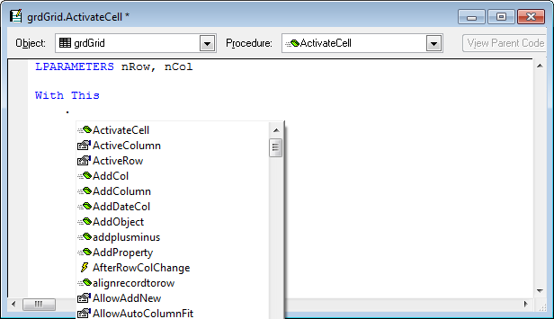

## Thor IntellisenseX for objects within WITH / ENDWITH

One of the real annoyances when using WITH / ENDWITH blocks is that native Foxpro Intellisense does not always kick in as expected.

It *does* work when you enter dot within blocks that begin with “With This”:

However, it does ***not*** work when you enter dot within blocks that begin with just about anything else:

*   With This.Parent
*   With This.SomeObject
*   With ThisForm
*   With ThisForm.SomeObject

IntellisenseX removes this annoyance by providing the expected dropdown list for these cases. (Note, however, that the display does not include icons, which is the indication that the dropdown list is from IntellisenseX)

