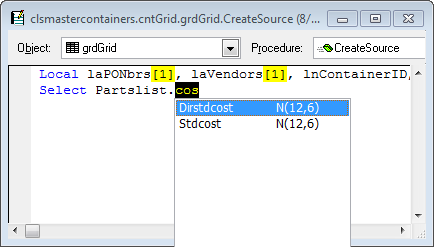

## Thor IntellisenseX Configuration

There are a number of options in the Thor Configuration form that control the display and handling of the listbox.

The native FoxPro handling of the dropdown list for Intellisense is that the first entry in the list that matches what you have types is highlighted.

If filtering is enabled, the behavior changes in that the list is progressively filtered to only show those entries that match. We recommend trying the second filter option, “match anywhere”, shown in this example in which only those field names that contain “cos” are displayed.

The second tab of IntellisenseX options controls the font and display count used for the dropdown listbox.

The last tab controls how field names are handled.

