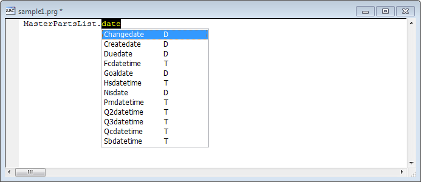
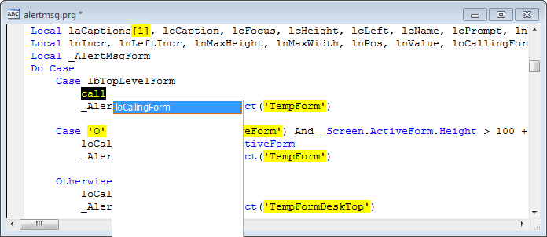

### IntellisenseX Configuration Options

There are a number of configuration options in Thor configuration form that apply to IntellisenseX. The major options are described here.

The first page has options that control the behavior of the listbox once you begin typing.

The default behavior mimics the behavior of native FoxPro Intellisense, in which the first item in the listbox that matches the typed characters is highlighted.

If filtering is enabled (by using the first checkbox), instead of highlighting the first item in the listbox that matches, only the items that match the typed characters are displayed. As you can see, the matching can be done against either the leading characters or anywhere in the item. This last option, patterned after some uses in Visual Studio, allows you to narrow your search very quickly:

### <a name="SampleIfOne">Auto-completion on single match</a>

For the tools that are not initiated by pressing dot, (**IntellisenseX by hotkey**, **DropDown Variables List**, and **DropDown Constants List**), you can begin typing part of the item to be selected <u>before</u> you call the tool. In this example, **DropDown Variables List** was executed after “call” was already entered, and the dropdown list has only one item (if you have selected “match anywhere” filter, above)

So, for the lazy developer, there is the option “Auto-completion on partial match”. If this option had been selected, then “loCallingForm” would have been pasted into the code immediately, without ever showing the listbox. This allows you to access your variables very rapidly by only entering enough of their names to uniquely identify them.

**Recommendation**: Turn on “match anywhere” filtering and the “Auto-completion on partial match” checkbox. You will become acclimated to these options very quickly.

### <a name="SamplePRGClasses">Handling of PEMS in PRG based classes</a>

The last page in the configuration for IntellisenseX allows you to specify how THIS is handled within PRG-based classes. (There is some consideration for including a third option, for custom and inherited PEMs. This would exclude PEMs from the baseclass that have their default values).

