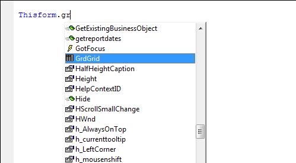

## Thor IntellisenseX Dot Glitch
It seems inevitable that there be one unavoidable glitch in any new IDE Tool.  
The tool **IntellisenseX by Dot** works by using On Key Label to capture any time you press a period (dot). However, there are times when this causes problems (rather than adding features) – when you want the dot to be handled “normally”.  

There are at least two reports of difficulties encountered:  

* If you are typing .T. or .F. there is enough of a delay that the second character may be goggled up. This can be remedied by typing slower.
* If you have a native FoxPro Intellisense dropdown list already and you press a dot, something else goes wrong:
In the example below, native Intellisense has displayed the list of members for Thisform, and after ‘gr’ has been entered, highlights the match to a grid named ‘GrdGrid’.

The normal behavior for Intellisense is that when you now enter a period (dot), the entire name ‘GrdGrid’ is entered into your code window followed by the dot. We have done this so often that it is reflexive behavior.

However, if **IntellisenseX by Dot** is active, pressing the dot here does NOT work as expected. The remainder of the word is not entered into your code window. Instead, you get this:

There are at least three different ways to get around this problem:

* Instead of pressing dot, press space + backspace + dot  
* Assign a hot key to **IntellisenseX by Dot** (which toggles it) so that you can turn it off before you press the dot, then press it again afterwards to re-active
**IntellisenseX by Dot.** 
* Use **IntellisenseX by Hot Key** instead, which does not have this issue.  
 
**Recommendation**: As annoying as this behavior may be from time to time, so much so that you may want to stop using **Intel … by Dot**
and begin using **Intel … by Hot Key** instead, we recommend sticking with
**Intel … by Dot** until you have become completely familiar with all the features automatically provided by it. Using
**Intel… by Hot Key,** after all, requires that you know when you can invoke IntellisenseX.
