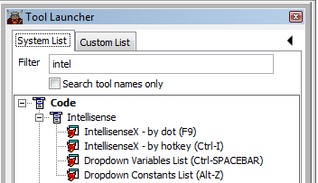
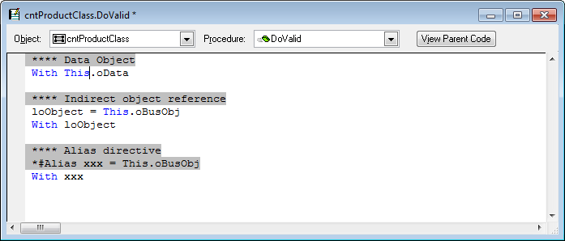
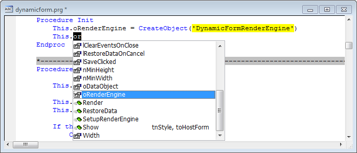
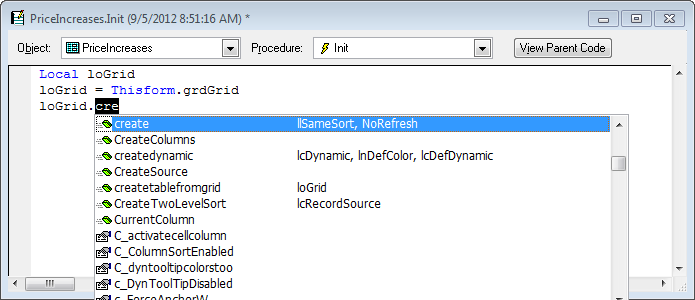
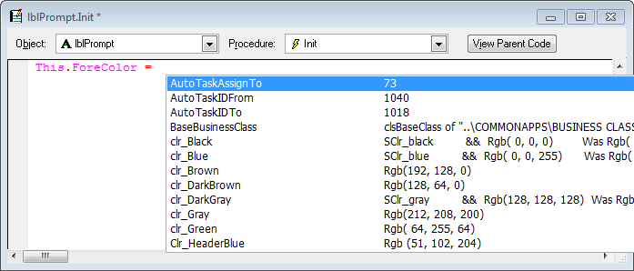

## Introduction

_IntellisenseX_ refers to a suite of Thor Tools that provide functionality similar to native Intellisense. These tools display lists of available variable names, field names, or members (properties, events, methods, and objects) while you type code, just like Intellisense. However, they cover those areas that Intellisense forgot (such as the list of field names in a table when editing in a code window) and provide new capabilities, available through customization, such as displaying the list of field names in an SQL table, as shown below

<!-- ## Videos**

*   Introduction and examples (planned)
*   Customization (planned) -->

## Installation Instructions

IntellisenseX is downloaded as part of the [Check For Updates](https://github.com/VFPX/Thor/blob/master/Docs/Thor_one-click_update.md) process for [Thor](https://github.com/VFPX/Thor/blob/master/README.md).

## Thor Tools

IntellisenseX is implemented through the use of four tools:

*   **IntellisenseX by Dot** is the main tool. Once executed, IntellisenseX is activated any time you press a period (dot), the same as for native Intellisense. The tool is actually a toggle. If you execute it a second time, the On Key Label is removed, and typing a dot simply works like normal. Unfortunately, there is an undesirable side effect to this technique. See [glitch when using Intellisense by Dot](Thor_IntellisenseX_Dot_Glitch.md).
*   **IntellisenseX by Hot Key** is the twin of **IntellisenseX by Dot**, except that it is activated differently, by using a hot key (which you define in Thor) instead of a dot. To activate the tool, press the hot key ***after*** you press the dot. This tool is available because of a [glitch when using Intellisense by Dot](Thor_IntellisenseX_Dot_Glitch.md).
*   **Dropdown Variables List** provides a list of local variables for those who do not use MDot (m.)
*   **Dropdown Constants List** provides a list of constants (created by #Define and #Include)

Like all Thor tools, these tools can be executed in a number of different ways, such as by using the Tool Launcher, as shown here, or by user-assigned hot keys.

### Examples of IntellisenseX

Unless otherwise noted, all examples provided are enabled by a single execution of the tool “IntellisenseX by dot”.

The following is a summary of the different types of dropdown lists available:

Variables (local and otherwise):

*   [Variables from MDot.](#SampleMDot)
*   [Variables using a hot key.](#SampleHotKeyLocals)

Field names:

*   [Fields from an open table (or view).](#SampleFieldsFromTable)
*   [Fields from an table that is not open (but is in the path).](#SampleFieldsFromClosedTable)
*   [Fields from a local_alias in an SQL statement.](#SampleFieldsSelectAlias)
*   [Fields from a SQL Server table](#SampleFieldsSQL)
*   [Fields from a Data Object](#SampleFieldsDataObject)

Property and Method names (PEMs) from objects:

*   [PEMs for objects referenced between WITH / ENDWITH](#SampleFieldsBetweenWith)
*   [PEMS referenced in PRG-based classes](#SampleFieldsPRGClasses)

Other:

*   [Indirect object references](#SampleObjectReference)
*   [*#Alias directive for tables and objects](#SampleAliasReferences)
*   [Listing Constants (created by #Define and #Include)](#SampleConstants)
*   [Setting ControlSources in PEM Editor](#SamplePEMEditor)

Usage notes; customizing the dropdown listbox

* * *

### <a name="SampleMDot">Variables (local and otherwise) from MDot</a>

Typing "m" and then a dot (period) will drop down a list of all variables in a procedure or method that are local, private, public, or are assigned values anywhere in the procedure.

[Back to top](#top)

* * *

### <a name="SampleHotKeyLocals">Variables (local and otherwise) using a hot key</a>

For those who do not use M-Dot notation, the same list of all variables in a procedure or method that are local, private, public, or are assigned values anywhere in the procedure.  can be obtained by a hot key. (This hot key is selectable in Thor). **See also another section about keying first, then using hot key.**

[Back to top](#top)

* * *

### <a name="SampleFieldsFromTable">Fields from an open table (or view)</a>

If a table (or view) is open, the dropdown list shows the list of fields as well as their data type and field width.

[Back to top](#top)

* * *

### <a name="SampleFieldsFromClosedTable">Fields from an table that is not open (but is in the path)</a>

If the alias for the table is not in use, the path is searched for a DBF of that name; if found. the table is opened and its fields are listed. [See Thor IntellisenseX for SQL Table](Thor_IntellisenseX_SQL_Table.md)

[Back to top](#top)

* * *

### <a name="SampleFieldsSelectAlias">Fields from a local_alias in an SQL statement</a>

If a local_alias is used in an SQL statement, the fields from the actual table (or alias) are shown. This does not apply to sub-queries (yet).

[Back to top](#top)

* * *

### <a name="SampleFieldsSQL">Fields from a SQL Server table</a>

The fields from an SQL Server table (“soheader” in the example below) can be displayed. This requires customization of a plug-in PRG (managed by Thor) that accesses the structure of the table. This can be done a few different ways, including using SQLColumns() or accessing a dictionary of the fields and in an SQL database. 
[See Thor plug-in OpenTable](https://github.com/VFPX/Thor/blob/master/Docs/Thor_add_plugins.md#opentable)

[Back to top](#top)

* * *

### <a name="SampleFieldsDataObject">Fields from a Data Object</a>

IntellisenseX can be used to display the fields from data objects that are based on an underlying table in a business object or in a form or visual class based on an underlying table, although doing so requires customization on your part.

The sample below accesses the underlying table that the current class is based on (found in “This.cAlias”) whenever “This.oData.” is entered.

[Thor IntellisenseX for Data Objects](Thor_IntellisenseX_Data_Object.md)

[Back to top](#top)

* * *

### <a name="SampleFieldsBetweenWith">PEMs for objects referenced between WITH / ENDWITH</a>

When using a “WITH” phrase (“With loObject”), if you do not use “as” (“With loObject **as** Textbox”), the only object for which FoxPro provides Intellisense in methods for visual classes is THIS:

This feels like an incomplete implementation, as there are a number of other objects for which it would seem that Intellisense would work:

*   With ThisForm
*   With This.Parent
*   With This.Parent.cboMaintTable
*   With Thisform.PageFrame.Pages[1]

These are all provided for by IntellisenseX, as shown in the following image:

Note as well the parameters list that appears in the second column. Once you have selected a method from the listbox, pressing Ctrl+Enter will insert both the method name and parameters into your code.

In addition, IntellisenseX also recognizes a number of other references to objects that follow WITH: see [Fields from a Data Object](#SampleFieldsDataObject), [Indirect object references](#SampleObjectReference), and [*#Alias directive for tables and objects](#SampleAliasReferences).

[Back to top](#top)

* * *

### <a name="SampleFieldsPRGClasses">PEMS referenced in PRG-based classes</a>

FoxPro provides Intellisense for THIS in PRG-based classes in a limited way: it might not show custom properties or methods in the class being edited at all (as shown below), if it does will not display them in the same case as they are defined, and the list is not updated as new properties or methods are added.

IntellisenseX provides an alternative that shows ***only*** the properties and methods defined in the current class (no inherited or native properties or methods, unless defined in the class), in their correct case. This list is always current as properties or methods are added. (Depending on interest, this list may be extended to include inherited properties and methods.)

This feature is disabled by default; to enable it, see [SamplePRGClasses](Thor_IntellisenseX_Configuration_Options.md#SamplePRGClasses)

[Back to top](#top)

* * *

### <a name="SampleObjectReference">Indirect object references</a>

IntellisenseX recognizes the use of variables that are assigned as objects in code, as shown below. The objects referenced may be either objects in the form or class, or a [Data Object](#SampleFieldsDataObject).

[Back to top](#top)

* * *

### <a name="SampleAliasReferences">#Alias directive for tables and objects</a>

It may happen that a variable (that actually refers to a specific object) or alias (that actually refers to a specific table) is not defined in code in such a way the one can tell what it refers to, even if the developer knows exactly what it refers to. In this case the *#Alias directive can be used to inform Intellisense how to interpret the variable or alias.

In the example below, the second line informs Intellisense that the variable toData actually refers to the object ThisForm.grdGrid, so that referring to toData later in the code displays the dropdown list of properties and methods for that grid. This works for form objects (as in the example), [Data Objects](#SampleFieldsDataObject), and aliases.

[Back to top](#top)

* * *

### <a name="SampleConstants">Listing Constants (created by #Define and #Include)</a>

The Thor tool **Dropdown Constants List** creates a dropdown list of all #Define’d constants. This list is created using the same code as is used by ZDEF, which traverses all #Include files as well. The second column in the display shows the value of each constant.

[Back to top](#top)

* * *

### <a name="SamplePEMEditor">Setting ControlSources in PEM Editor</a>

PEM Editor has been enhanced to recognize most of the IntellisenseX capabilities described here when entering a ControlSource. It will recognize:

*   Object references (Thisform, e.g., as shown below)
*   Table or alias references (PartsList)
*   [Data Objects](#SampleFieldsDataObject) (This.oData)

Note that if you set the ControlSource to a property of Thisform that does not exist, you will be asked if you want it to be created.

[Back to top](#top)
