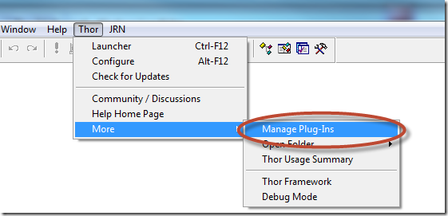
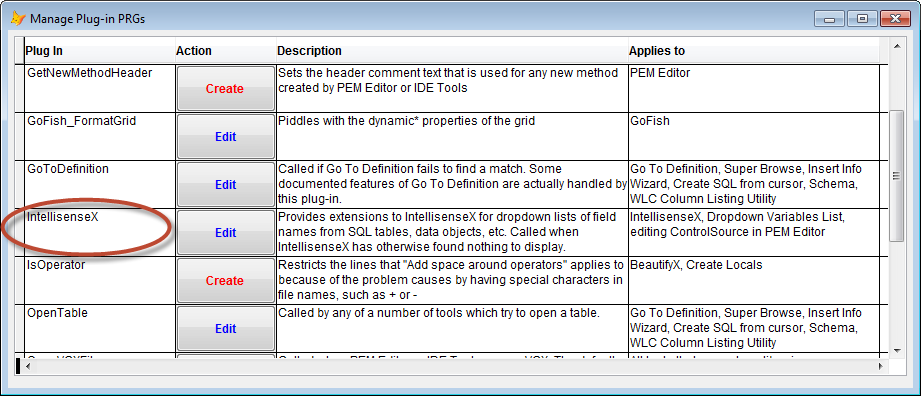

## Thor IntellisenseX Plug-In for handling SQL tables and data objects

Thor provides a number of Plug-In PRGs to alter or enhance the behaviors of some of the Thor Tools. You can create or edit Plug-Ins by using the Manage Plug-Ins menu item in the Thor menu:



The Plug-In called “IntellisenseX” is called by IntellisenseX after it has exhausted all other interpretations of what precedes the dot.



There is a single object passed in as a parameter and a number of properties from that object contain values of use within the PRG. They are described in the comments in the sample PRG supplied when you click the action ‘Create’, and include the text to the left of the just-entered dot (called ‘lcEntityName’) and also an object reference to the current form or class being edited.

The uses of this PRG are limited only by your needs and creativity. Here are a few samples, implemented in the sample PRG:

*   If the name supplied is the name of an SQL table, it finds and returns the list of fields in that table. In the sample, the field descriptions are saved in a free table. They could just as well be obtained by a call to SQLColumns(). In any case, the list of fields is returned as a collection.
*   If the class being edited is a business object for a particular table, the name of table may be contained in a property of the class (or its name), and a reference to the DataObject for that business object would refer to the fields in the table. In the sample PRG, references to “This.oData” are assumed to occur in classes that are based on wwBusiness from West-Wind, and the name of the underlying table is to be found in “This.cAlias”. Typing the dot after “This.oData” displays the fields from the underlying table.
*   If the form or visual class being edited is designed to work with a single business class (such as the one above), there may be a standard structure that refers to the business object. In the sample, references to “Thisform.oBusObj.oData” are assumed to be references to the DataObject whose underlying table is found in “ThisForm.cAlias” and will display the fields from that table.
*   If **Intellisense by Hot Key** was used (this information is contained in one the properties passed in), then it uses the underlying table in “ThisForm.cAlias” regardless of what was entered before the dot. This allows you, for example, to enter “loObject.” and use IntellisenseX show the list of fields from the underlying table when there could be no way to know what loObject refers to.

The result of the PRG can be an alias of an open table (from which the field names will be displayed), a Collection object of names to be displayed, or an object whose members (PEMs) are to be displayed (there are no samples of this last usage). The result must be passed using this rather odd looking construction required of Plug-In PRGs:

```foxpro
Return Execscript (_Screen.cThorDispatcher, 'Result=', lxReturn)
```
