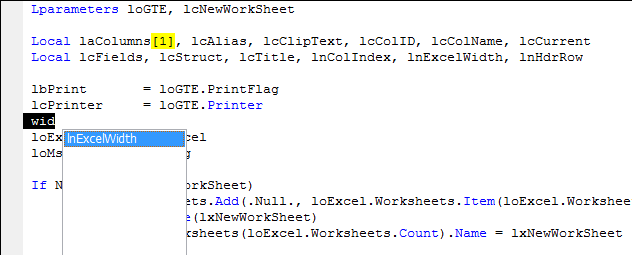

## Thor IntellisenseX List Variables

IntellisenseX produces a dropdown list of variable names used in a procedure. This list includes all parameters and locals as well as variables assigned but not yet in a LOCAL statement.

In the example below, note that ‘lbPrint’ and ‘lcPrinter’ appear in the dropdown list even though they are neither parameters nor locals. This behavior, not seen in other tools that provide variable lists, is provided for those who create their LOCAL statements after writing their code (such as by using Thor Tools **BeautifyX** or **Create Locals**).

For those who use MDots (m.) in their code, the variable list pops up immediately after pressing MDot.

For those who do not use MDot, the Thor tool **Dropdown Variables List** produces the same list. This tool works best if assigned to a hot key, because of its frequency of use. Note, however, that when you assign the hot key (in the Thor Configuration form or using Tool Launcher), you can only use of one of Ctrl, Shift, or Alt, else the dropdown list does not appear where it should (or not at all).

A not obvious feature of the tool **Dropdown Variables List** is that you can begin typing part of the variable name before using the tool. When combined with the “match anywhere” filter (see the [Thor configuration form](Thor_IntellisenseX_Configuration.md)), it becomes very easy to find a variable using only part of its name.

In fact, if you have selected the rather verbose option “Select immediately on entry if exactly on match found”, if you enter part of a variable name and there is exactly one match when you call **Dropdown Variables List**, the dropdown list is skipped altogether and the full name of the variable is inserted.

