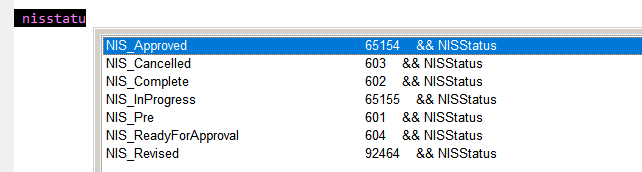

## Using the IntellisenseX DropDown

The dropdown listbox from IntellisenseX is designed to work like the dropdown from native FoxPro Intellisense, but with improvements.

Typing highlights the first match to what has been entered. Settings in the [Thor configuration form](Thor_IntellisenseX_Configuration.md) can alter this behavior so that instead of highlighting the first match, the list is progressively filtered as you type. The “match anywhere” filter, a concept borrowed from Visual Studio, can be very effective, as seen in this example in which only the fields that contain ‘cos’ are displayed.

The normal list of characters that cannot be part of a name (punctuation) terminate the drop down, select the highlighted item and then insert the character typed. A space is automatically inserted before those characters that are operators (plus, minus, etc).

### Extended Filtering

There are a number of DropDown Thor Tools that use this same dropdown listbox.  Many of the displays show additional columns of information.  "DropDown Constants", for instance, shows not only the constants available but also their associated values and any comments on the same line.  As seen in the image below, the filtering is applied to all columns in the display (not simply the first column as you normally expect).

### Additional Keystrokes

* **Ctrl+Enter** is a special case that applies when the dropdown list is a list of properties and methods.  The second column in the dropdown gives the parameter list, if available.  This keystroke selects the current item from the dropdown and pastes the parameter list into edit window as well.
* **Ctrl+C** copies the contents of the second visible column into the clipboard.
* **Ctrl+Z** closes the popup and leaves the text already entered as is, whether it matches anything in the dropdown or not.

### Notes
* The listbox is contained actually contained within a modal form. Thus, to remove the dropdown, you must press the Esc key.
* The listbox is resizable.  However its changed size does not persist to the next use.