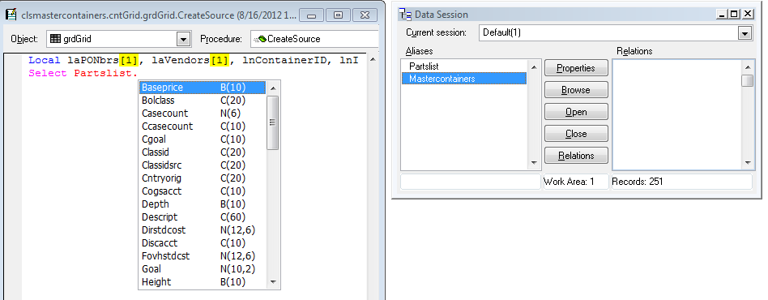

## Thor IntellisenseX for the alias of an open table

If the name preceding the dot is the alias of an open table or view, the fields from that table/view are displayed

Settings in the [Thor configuration form](Thor_IntellisenseX_Configuration.md) control the order in which the field names are displayed, how capitalization is handled, and whether the field types and widths are displayed.

